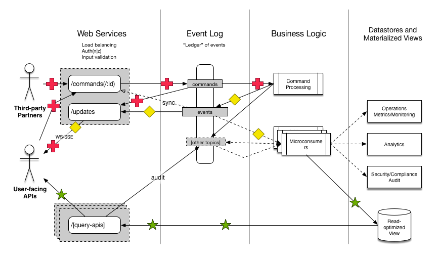

# What is CQRS Manager for Distributed Reactive Services?

CQRS Manager for Distributed Reactive Services (herein abbreviated
CMDR) is a component that provides the organizing principle in a
specific [architecture](./architecture.png) for building real-time,
event-driven APIs with complex business logic at large scale.  This
architecture incorporates several well-known patterns:

* [CQRS](https://msdn.microsoft.com/en-us/library/dn568103.aspx)
  (Command Query Responsibility Segregation), the separation of the
  write and read paths in an application
* [Event Sourcing](https://msdn.microsoft.com/en-us/library/dn589792.aspx),
  the modeling of state by capturing all domain events
* [Immutable Log-centric](https://engineering.linkedin.com/distributed-systems/log-what-every-software-engineer-should-know-about-real-time-datas-unifying),
  Using an append-only log of immutable values to capture domain
  events
* [Reactive](http://www.reactivemanifesto.org/) Responsive, Resilient,
  Elastic, and Message Driven. Discrete components react to messages
  (commands and events) independently, with low latency, and in a
  fault-tolerant way.

The combination of the above ideas has the potential to solve many of
the thorny problems in existing service architectures.

## Problem

Many APIs and services are architected something like this:

This architecture is problematic in several ways:

### Data Loss by Design

### Lack of System Data Contracts Discourages Integration

### Coupling of Action and Perception

### Leaky Database Abstraction

### Cross-cutting Concerns Interwoven with Application Concerns

## Goals

In contrast, the CMDR architecture seeks to:

### Capture Entire Narrative

### Ease Integration via Data Contracts

### Separate Action from Perception

### Satisfy Cross-cutting Concerns given Conway's Law

## CMDR Architecture

CMDR provides web interfaces to handle incoming writes/commands,
performs basic structural validation, and then writes them down to the
commands topic in the log (Kafka for now, with support for other
distributed log systems planned).  See the
[data contract docs](./using.md) for more information on the specific
data definition of the terms "command" and "event".

The application's own processes take over from there, first processing
the incoming commands from the log, determining how to handle them,
and then emitting one or more events to the event topic in the log.
This command processor is a special case, and each command should only
be handled by a single command processor.

Downstream event processors are a bit different, as many event
processors can react to the same set of events, and can emit zero or
more events in response to those events.

Some of these events will cause side effects of some kind, such as
writing to a database.  Most distributed log systems (like Kafka)
provide at-least-once message processing semantics, so event
processors should be idempotent in terms of side-effects.

## Context and References

* Rich Hickey's talks on
  [the Value of Values](https://www.infoq.com/presentations/Value-Values)
  and
  [the Language of the System](https://www.youtube.com/watch?v=ROor6_NGIWU)
* [Datomic](http://www.datomic.com/)'s [architecture](http://docs.datomic.com/architecture.html)
* Martin Kleppman's talks and writings
  * [Turning the database inside-out with Apache Samza](http://www.confluent.io/blog/turning-the-database-inside-out-with-apache-samza/)
  * [Using logs to build a solid data infrastructure](http://www.confluent.io/blog/using-logs-to-build-a-solid-data-infrastructure-or-why-dual-writes-are-a-bad-idea/)
  * [Stream processing, event sourcing, reactive CEP](https://martin.kleppmann.com/2015/01/29/stream-processing-event-sourcing-reactive-cep.html)
* [Jay Kreps article](https://engineering.linkedin.com/distributed-systems/log-what-every-software-engineer-should-know-about-real-time-datas-unifying)
  on the Log as the unifying abstraction in distributed systems
* [Neha Narkhede's blog post](http://www.confluent.io/blog/event-sourcing-cqrs-stream-processing-apache-kafka-whats-connection/)
  on the connection between CQRS, Event Sourcing, Stream Processing,
  and Kafka
* Bobby Calderwood's [Strange Loop 2016 talk](https://speakerdeck.com/bobbycalderwood/commander-better-distributed-applications-through-cqrs-event-sourcing-and-immutable-logs)
